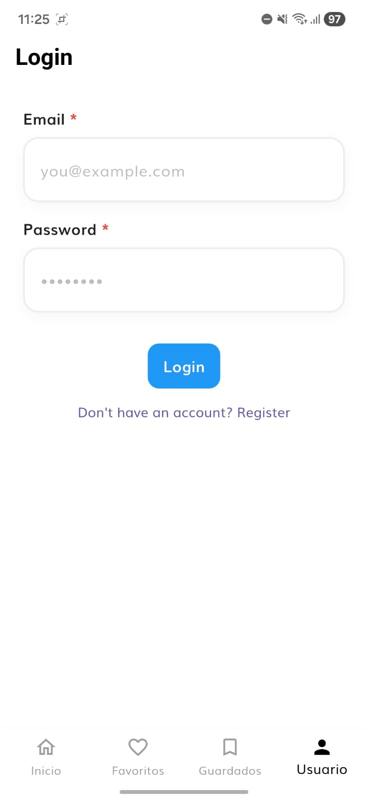
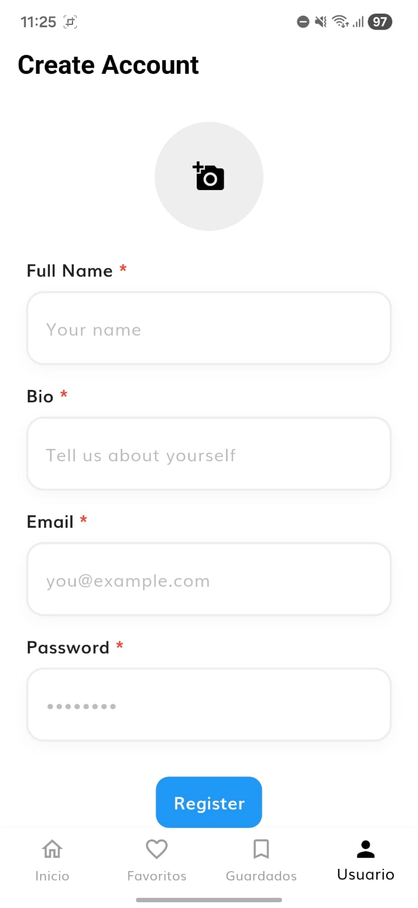
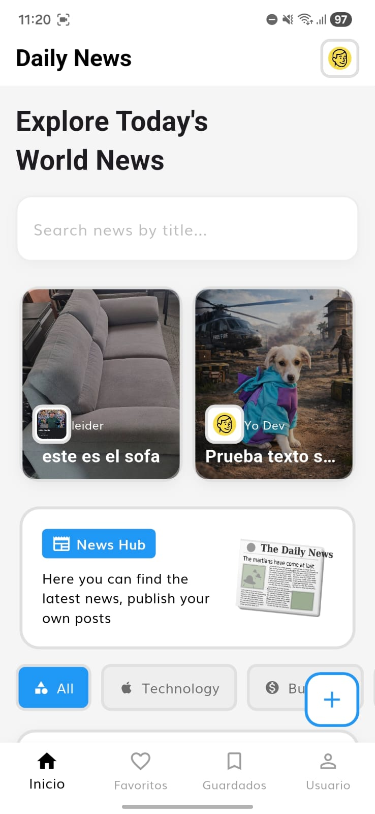
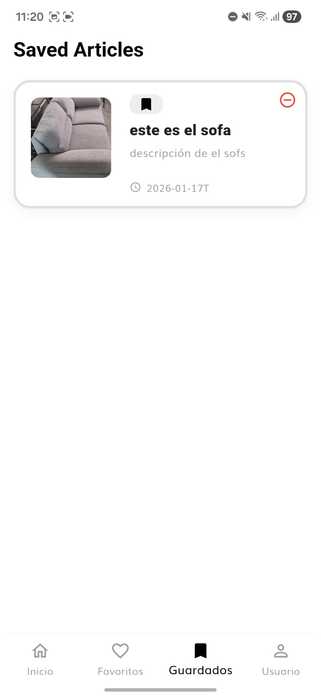
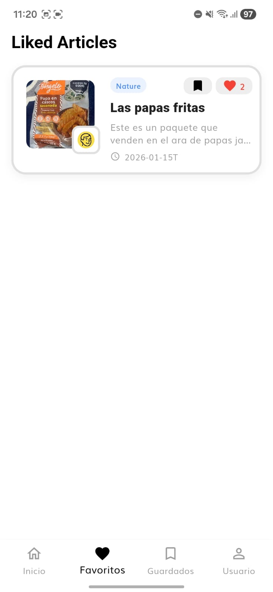
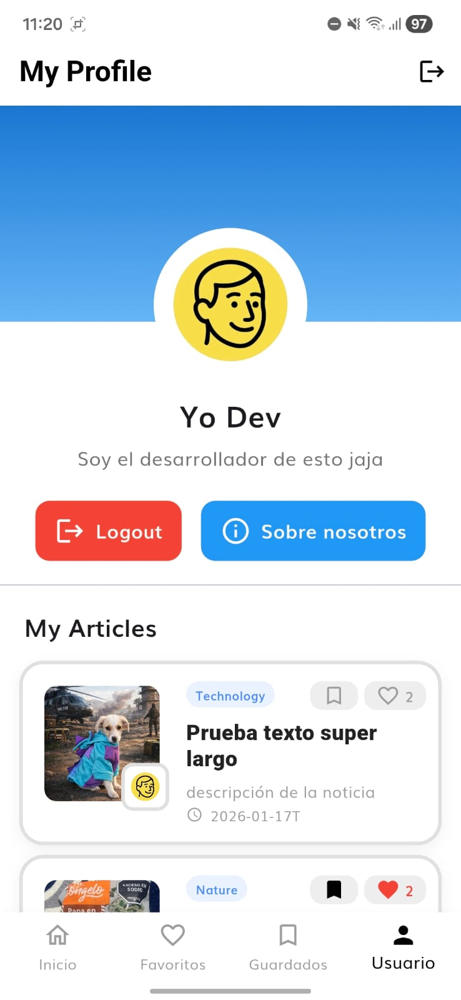
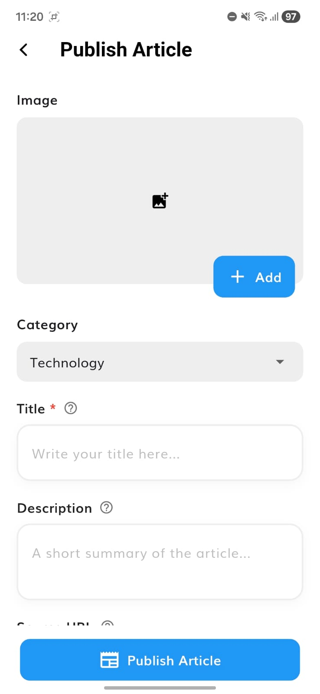
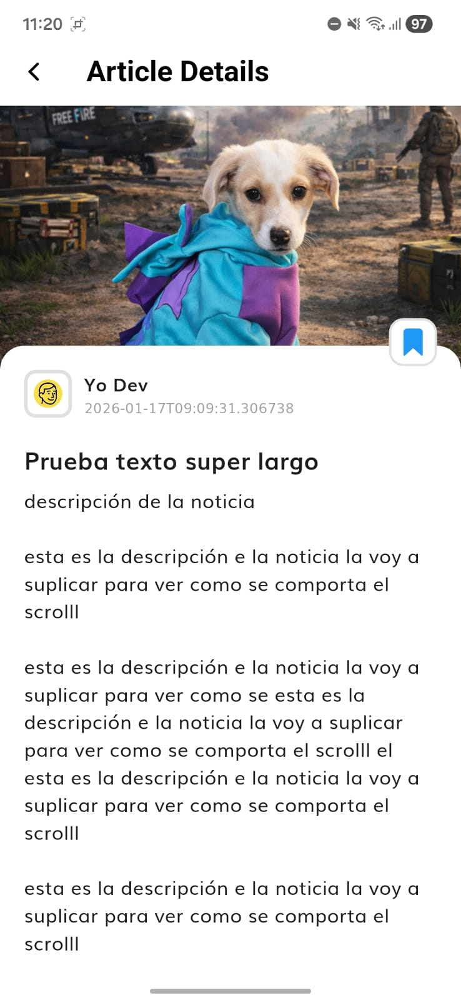

# Report - Applicant Showcase App

## 1. Introduction

Este proyecto representó una oportunidad única para profundizar en tecnologías que, aunque conocía parcialmente, nunca había integrado de manera completa. Mi experiencia previa con Flutter me daba una base sólida, pero este proyecto me permitió explorar aspectos más avanzados como la arquitectura limpia, el patrón BLoC, y la integración completa con Firebase.

La aplicación desarrollada es una News App que permite a periodistas subir sus propios artículos, creando una plataforma donde la comunidad puede acceder tanto a noticias de APIs externas como a contenido generado por usuarios. El diseño de la aplicación refleja mi estilo personal, inspirado en un enfoque más cartoon y animado, similar al que utilizo en mi sitio web yodev.com.co, buscando crear una experiencia visual atractiva y moderna.

---

## 2. Learning Journey

### 2.1 El Patrón BLoC: Una Nueva Forma de Pensar el Estado

Antes de este proyecto, mi experiencia con gestión de estado en Flutter se limitaba principalmente a GetX y Provider. Conocía el concepto de BLoC por referencias, pero nunca lo había implementado en un proyecto real. La experiencia de aprender BLoC fue fascinante porque, aunque comparte similitudes con Provider en cuanto a la separación de lógica y UI, introduce un nivel de estructura y organización que me resultó muy interesante.

Lo que más me llamó la atención del patrón BLoC fue cómo separa claramente los eventos (Events) de los estados (States), creando un flujo unidireccional de datos que hace el código mucho más predecible y fácil de depurar. A diferencia de GetX, donde la reactividad está más integrada en los widgets, BLoC requiere una estructura más explícita que, aunque inicialmente puede parecer verbosa, termina siendo más mantenible a largo plazo.

Durante el desarrollo, implementé varios BLoCs y Cubits: `AuthBloc` para manejar la autenticación, `RemoteArticlesBloc` para artículos desde Firestore y APIs externas, `LocalArticleBloc` para artículos guardados localmente, y `PublishArticleCubit` para la publicación de nuevos artículos. Cada uno me enseñó algo diferente sobre cómo estructurar la lógica de negocio y cómo comunicarla con la capa de presentación.

### 2.2 Clean Architecture: El Orden en el Caos

La estructura de carpetas siguiendo Clean Architecture fue, sin duda, uno de los aspectos más desafiantes pero también más enriquecedores del proyecto. Al principio, la separación en tres capas (Presentation, Domain, Data) me pareció un poco compleja, especialmente viniendo de proyectos donde la estructura era más plana. Sin embargo, conforme avanzaba en el desarrollo, comencé a entender la verdadera potencia de esta organización.

Lo que más me impactó fue cómo la capa Domain (Business Logic) está completamente desacoplada de Flutter y Firebase. Escribir código puro en Dart, sin dependencias de frameworks, me hizo entender mejor la diferencia entre lógica de negocio y lógica de implementación. Esta separación me permitió pensar primero en "qué" necesita hacer la aplicación antes de preocuparme por "cómo" se implementará.


### 2.3 Firebase: Más Allá de la Autenticación Básica

Mi experiencia previa con Firebase se limitaba principalmente a Firebase Auth para login básico. Este proyecto me llevó a explorar profundamente tres servicios de Firebase: Authentication, Firestore y Cloud Storage, cada uno con sus propias complejidades y casos de uso.

**Firebase Authentication y Perfiles de Periodistas**

La implementación de Firebase Auth para crear perfiles de periodistas fue una experiencia reveladora. Aprendí cómo crear usuarios con `createUserWithEmailAndPassword()`, pero lo más interesante fue entender cómo extender la información del usuario más allá de lo que Firebase Auth proporciona por defecto. La solución fue crear una colección `users` en Firestore que almacena información adicional como `fullName`, `bio`, y `photoUrl`, vinculada al `uid` del usuario autenticado.

Este enfoque me enseñó la diferencia entre la autenticación (quién eres) y la autorización/perfiles (qué información adicional tienes). La integración entre Firebase Auth y Firestore para crear perfiles completos fue uno de los aprendizajes más valiosos, especialmente cuando tuve que manejar casos donde el usuario está autenticado pero aún no tiene un perfil creado en Firestore.

### 2.4 Streams y Actualización en Tiempo Real

Una de las funcionalidades más interesantes que implementé fue el uso de Streams de Firestore para actualización en tiempo real. En lugar de usar `FutureBuilder` que solo carga datos una vez, implementé `StreamBuilder` en las pantallas de favoritos y perfil, lo que permite que los datos se actualicen automáticamente cuando hay cambios en Firestore.

---

## 3. Challenges Faced

### 3.1 Las Reglas de Seguridad: Un Mundo Nuevo

Uno de los mayores desafíos fue entender y configurar correctamente las reglas de seguridad de Firestore y Storage. Al principio, tenía errores 403 (Permission denied) constantemente, y no entendía por qué. Aprendí que las reglas se evalúan en el servidor, no en el cliente, y que cualquier cambio requiere desplegarse explícitamente a Firebase.

El proceso de iteración fue: escribir reglas, desplegarlas, probar, encontrar errores, ajustar, y repetir. Esto me enseñó la importancia de pensar en seguridad desde el principio, no como una adición posterior. También aprendí a balancear entre seguridad y usabilidad: hacer los artículos públicos para lectura permite que cualquiera pueda ver el contenido, pero mantener la escritura restringida protege la integridad de los datos.

### 3.2 La Arquitectura: Pensar en Capas

Adaptarme a Clean Architecture fue un proceso gradual. Al principio, me sentía perdido sobre dónde poner cada pieza de código. ¿Este método va en el repository o en el use case? ¿Esta lógica es de negocio o de presentación? Con el tiempo, desarrollé una intuición sobre cómo separar las responsabilidades.

El mayor desafío fue mantener la disciplina de no violar las reglas de dependencias. Hubo momentos donde quería importar algo directamente desde la capa de datos en la presentación, pero la arquitectura me forzaba a pensar en una mejor solución. Esto resultó en código más limpio y mantenible, aunque requirió más tiempo de diseño inicial.

### 3.3 Integración de Múltiples Fuentes de Datos

Combinar artículos de una API externa (NewsAPI) con artículos publicados por usuarios en Firestore fue técnicamente desafiante. Tuve que pensar en cómo unificar estos dos orígenes de datos diferentes en una sola lista, manteniendo la consistencia en la UI. La solución fue usar el `RemoteArticlesBloc` que primero obtiene artículos de Firestore y luego complementa con la API externa cuando es necesario.

---

## 4. Reflection and Future Directions

### 4.1 Lo que Aprendí Técnicamente

Este proyecto me enseñó que hay mucho más en Flutter y Firebase de lo que inicialmente conocía. El patrón BLoC, aunque similar a Provider en concepto, introduce una estructura más robusta que es especialmente útil en proyectos grandes. La Clean Architecture, aunque inicialmente compleja, proporciona una base sólida para mantener código organizado y escalable.


### 4.2 Lo que Aprendí Profesionalmente

Más allá de lo técnico, este proyecto me enseñó sobre la importancia de la documentación y la organización. Seguir las guías de arquitectura y coding guidelines me hizo entender cómo se trabaja en equipos profesionales. La disciplina de mantener el código limpio y organizado no es solo una preferencia estética, sino una necesidad práctica para proyectos que crecen con el tiempo.

También aprendí sobre la importancia de la seguridad desde el principio. Configurar reglas de Firestore y Storage correctamente desde el inicio evita problemas de seguridad que son difíciles de corregir después. Esto me enseñó a pensar en seguridad no como una característica adicional, sino como un aspecto fundamental del diseño.

### 4.3 Mejoras Futuras

Hay varias áreas donde el proyecto podría mejorarse. Una implementación completa de testing sería valiosa, especialmente unit tests para los use cases y widget tests para los componentes de UI. También sería interesante implementar paginación para manejar grandes cantidades de artículos de manera más eficiente.

Otra mejora sería implementar notificaciones push para alertar a los usuarios sobre nuevos artículos de periodistas que siguen. También podría agregarse un sistema de comentarios en los artículos, lo cual requeriría una nueva estructura en Firestore y reglas adicionales.

La búsqueda podría mejorarse con una solución de búsqueda full-text más robusta, posiblemente usando Algolia o una función de búsqueda de Firestore más avanzada. Y finalmente, implementar un sistema de caché más inteligente para las imágenes y datos reduciría el uso de ancho de banda y mejoraría la experiencia offline.

---

## 5. Proof of the Project

### 5.1 Video Demostrativo

<video width="100%" controls>
  <source src="assets/video.mp4" type="video/mp4">
  Tu navegador no soporta el elemento de video.
</video>

*Video mostrando el funcionamiento completo de la aplicación, incluyendo autenticación, publicación de artículos, navegación entre pantallas y funcionalidades principales.*

**Descargar APK (Versión 1.0.0+2)**

<a href="assets/app-release_1.0.0+2.apk" download style="display: inline-block; padding: 12px 24px; background-color: #2196F3; color: white; text-decoration: none; border-radius: 8px; font-weight: bold; margin-top: 16px;">
  📱 Descargar APK v1.0.0+2
</a>

### 5.3 Screenshots por Pantalla

| Pantalla | Descripción | Screenshot |
|----------|-------------|------------|
| **Login** | Pantalla de inicio de sesión con email y contraseña. Permite acceder con credenciales existentes. |  |
| **Registro** | Pantalla de registro con campos para email, contraseña, nombre completo, biografía opcional y selección de imagen de perfil. Permite crear una nueva cuenta de periodista. |  |
| **Inicio (Daily News)** | Pantalla principal con feed de artículos combinando contenido de Firestore y API externa. Incluye búsqueda, filtros por categoría, y botón flotante para publicar nuevos artículos. |  |
| **Guardados (Saved)** | Lista de artículos guardados localmente usando SQLite (Floor). Permite acceso offline a artículos favoritos del usuario. |  |
| **Favoritos (Liked)** | Lista de artículos con like del usuario, actualizada en tiempo real usando Streams de Firestore. Los cambios se reflejan instantáneamente. |  |
| **Perfil (Profile)** | Perfil de usuario con información personal, foto, biografía, y lista de artículos publicados. Incluye botones de acción (Logout, Sobre nosotros) para perfil propio. |  |
| **Subir Artículo (Publish)** | Formulario completo para crear y publicar nuevos artículos. Incluye selección de imagen, categoría, título, descripción, URL opcional y contenido. Tiene validación de campos requeridos y diálogo de confirmación al salir. |  |
| **Detalle de Artículo** | Vista detallada del artículo con imagen destacada, información del autor (clickeable para ver perfil), contenido completo, y acciones (like, bookmark para artículos de Firebase, launch para abrir URL original). |  |

---

## 6. Overdelivery

### 6.1 Funcionalidades Adicionales Implementadas

Más allá de los requisitos básicos, implementé varias funcionalidades que mejoran significativamente la experiencia del usuario. El sistema de likes en tiempo real permite a los usuarios interactuar con los artículos, y los cambios se reflejan instantáneamente gracias al uso de Streams de Firestore. La funcionalidad de guardar artículos localmente usando SQLite (Floor) permite que los usuarios accedan a sus artículos favoritos incluso sin conexión a internet.

También implementé un sistema de actualización automática: cuando publicas un artículo, este aparece inmediatamente en tu perfil y en el feed principal sin necesidad de recargar la aplicación. Esto se logró mediante la integración de Streams y la recarga inteligente de BLoCs después de acciones importantes.

El diálogo de confirmación al salir de la pantalla de publicación previene la pérdida accidental de trabajo. Si el usuario ha ingresado contenido y presiona el botón de retroceso, se le pregunta si está seguro de salir, protegiendo su progreso.

### 6.2 Diseño y Experiencia de Usuario

El diseño de la aplicación refleja mi estilo personal, buscando crear una experiencia visual atractiva y moderna. Utilicé un enfoque más cartoon y animado, similar al estilo de yodev.com.co, con colores vibrantes, bordes redondeados, y sombras sutiles que dan profundidad a los elementos.

La navegación está diseñada para ser intuitiva, con un bottom navigation bar que permite acceso rápido a las secciones principales. Los widgets personalizados como `MyWdgButton`, `MyWdgTextField`, y `MyWdgTileButton` mantienen consistencia visual en toda la aplicación.

### 6.3 Arquitectura y Código

Seguí estrictamente la Clean Architecture especificada en las guías del proyecto, creando una separación clara entre las capas de presentación, dominio y datos. Esto resultó en código más mantenible y testeable, aunque requirió más tiempo de diseño inicial.

Implementé reglas de seguridad robustas tanto en Firestore como en Storage, asegurando que los datos estén protegidos mientras permiten la funcionalidad necesaria. Las reglas están diseñadas para ser públicas en lectura (artículos y perfiles pueden ser vistos por cualquiera) pero restrictivas en escritura (solo usuarios autenticados pueden publicar o editar).

### 6.4 Cómo Mejorar

Hay varias áreas donde el proyecto podría expandirse. Un sistema de comentarios en los artículos agregaría una capa de interacción social. Las notificaciones push para nuevos artículos de periodistas seguidos mejorarían el engagement. Un sistema de seguimiento de periodistas permitiría a los usuarios crear feeds personalizados.

También sería valioso implementar un sistema de moderación de contenido, especialmente si la aplicación escala. Y finalmente, analytics más detallados ayudarían a entender cómo los usuarios interactúan con el contenido.

---

## 7. Estructura de Carpetas
La aplicación sigue una estructura de carpetas estricta que separa las responsabilidades:

```
lib/
├── config/          # Configuración global (rutas, temas)
├── core/            # Recursos compartidos (constantes, utilities)
├── features/
│   ├── auth/        # Feature de autenticación
│   │   ├── data/    # Implementación de repositorios y data sources
│   │   ├── domain/  # Lógica de negocio pura (entities, use cases)
│   │   └── presentation/ # UI (screens, widgets, blocs)
│   └── daily_news/  # Feature de noticias
│       ├── data/    # Integración con Firestore, Storage, API externa
│       ├── domain/  # Entidades y casos de uso
│       └── presentation/ # Pantallas y gestión de estado
└── injection_container.dart # Dependency Injection
```


## Conclusión

Este proyecto fue una experiencia de aprendizaje intensiva y gratificante. Aprendí no solo nuevas tecnologías y patrones, sino también nuevas formas de pensar sobre la arquitectura de software y la organización del código. El patrón BLoC, aunque inicialmente complejo, se convirtió en una herramienta poderosa para gestionar el estado de manera predecible. La Clean Architecture, aunque requiere más disciplina inicial, proporciona una base sólida para proyectos escalables.

Firebase se reveló como una plataforma mucho más completa de lo que inicialmente conocía. Aprender a configurar reglas de seguridad, estructurar datos NoSQL, y aprovechar Streams para actualización en tiempo real abrió nuevas posibilidades en mi desarrollo.

El diseño de la aplicación, inspirado en mi estilo personal, refleja mi visión de cómo debería verse y sentirse una aplicación moderna. La combinación de funcionalidad robusta con una experiencia de usuario atractiva fue uno de los aspectos más satisfactorios del proyecto.

Este proyecto no solo cumplió con los requisitos técnicos, sino que me permitió crecer como desarrollador, aprendiendo nuevas formas de estructurar código y pensar en arquitectura de software.
